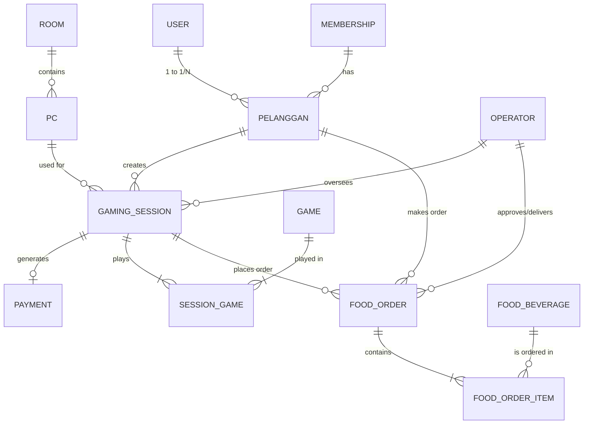

# LAPORAN UJIAN AKHIR SEMESTER - BASIS DATA LANJUT

## 1. Latar Belakang Kebutuhan Fitur & Solusi
Sistem Manajemen Warnet Gaming sebelumnya telah berhasil mengelola sesi bermain, billing, dan membership. Namun, pendapatan F&B (Food & Beverage) yang signifikan belum memiliki pencatatan yang terpusat dan terintegrasi dengan sesi aktif pelanggan. 

**Solusi yang diimplementasikan:**
Menambahkan 3 tabel baru ke skema basis data eksisting:
1. `food_beverages`
2. `food_orders`
3. `food_order_items`

---

## 2. Kamus Data & Justifikasi Normalisasi (D.1)

### Kamus Data Tabel Baru
**Tabel `food_beverages`**
- `id` (BIGINT, PK): Identitas unik menu.
- `name` (VARCHAR, INDEX): Nama menu.
- `category` (ENUM: 'food', 'drink', 'snack'): Kategori item.
- `price` (DECIMAL 10,2): Harga per satuan.
- `stock` (INT, DEFAULT 0): Jumlah stok tersisa.
- `is_available` (BOOLEAN, DEFAULT TRUE): Status ketersediaan aktif.

**Tabel `food_orders`**
- `id` (BIGINT, PK): Identitas unik pesanan.
- `gaming_session_id` (BIGINT, FK): Sesi bermain yang terhubung (Cascade Delete).
- `pelanggan_id` (BIGINT, FK): Pelanggan yang memesan (Cascade Delete).
- `operator_id` (BIGINT, FK Nullable): Operator yang melayani.
- `total_amount` (DECIMAL 10,2): Total harga pesanan.
- `status` (ENUM, DEFAULT 'pending', INDEX): Status ('pending', 'paid', 'delivered', 'cancelled').

**Tabel `food_order_items`**
- `id` (BIGINT, PK): Identitas unik baris detail.
- `food_order_id` (BIGINT, FK): Order terkait.
- `food_beverage_id` (BIGINT, FK): Menu terkait.
- `quantity` (INT): Jumlah yang dibeli.
- `subtotal` (DECIMAL 10,2): Harga x Quantity.

### Justifikasi Normalisasi 3NF
Desain di atas sudah memenuhi **3NF**:
1. **1NF**: Setiap atribut bersifat atomik. Data detail pesanan yang bersifat *repeating group* dipisahkan menjadi tabel *junction* `food_order_items`.
2. **2NF**: Pada `food_order_items`, `subtotal` dan `quantity` bergantung penuh pada komposisi *primary key* baris tersebut, bukan hanya sebagian.
3. **3NF**: Tidak ada *transitive dependency*. Nilai `total_amount` pada `food_orders` dikalkulasi dari anak-anaknya dan disimpan sebagai cache ringkasan operasional transaksi, sehingga menghindarkan anomali saat harga `food_beverages` berubah di masa depan (harga historis tetap aman).

---

## 3. Keamanan, Optimasi, dan Concurrency (D.4)

- **Indexing**: 
  1. `name` pada `food_beverages`: Diperlukan karena menu sering dicari berdasarkan nama melalui API filter katalog.
  2. `status` pada `food_orders`: Mempercepat query Eager Loading operator saat memfilter pesanan yang "pending" atau "paid" untuk disajikan.
- **Validasi Input**: Menggunakan fungsi `$request->validate()` pada seluruh endpoint POST/PUT untuk mencegah SQL Injection & data kotor (misal: validasi nilai minus pada stok/kuantitas).
- **Otorisasi Berbasis Role**: Menambahkan kolom `role` pada `users`. Operasi CRUD (Create, Update, Delete) pada `food_beverages` hanya bisa diakses oleh *admin*. Jika user biasa (pelanggan) mencoba mengakses, sistem mengembalikan *HTTP 403 Forbidden* via validasi role di controller (contoh: `if($request->user()->role !== 'admin') abort(403);`).
- **Race Condition / Concurrency**: Diaplikasikan pada API *checkout* pemesanan. Saat 2 bilik PC memesan mie instan yang tersisa 1 porsi pada milidetik yang sama, digunakan strategi *Pessimistic Locking* melalui method `DB::transaction()` dipadukan dengan `FoodBeverage::lockForUpdate()`. Hal ini menjamin bahwa query stok bersifat atomik.

---

## 4. Alur Validasi Berlapis (Multi-step Validation)
Saat API `/api/food-orders` dipanggil (POST), validasi dilakukan secara berurutan:

| Langkah | Aksi Validasi | Respons jika Gagal |
| --- | --- | --- |
| 1 | Pengecekan *body* (struktur array, FK exists, minimum qty 1) | **422 Unprocessable Entity** (Laravel Validator Error) |
| 2 | Pengecekan status `gaming_session` (harus 'active' / 'started') | **422 Unprocessable Entity** `{"message":"Gaming session is not active"}` |
| 3 | *Database Transaction & Lock* (mencegah *race condition*) | Menunggu (wait lock) |
| 4 | Pengecekan `stock` di db mencukupi `quantity` pesanan | **500 Server Error** (Exception *"Insufficient stock"*) & Rollback Transaksi |
| 5 | Deduct stok, buat order, insert *items*. | **201 Created** (Sukses) |

---

## 5. ERD FINAL (Original + Ekstensi F&B)



---

## 6. DOKUMENTASI API 

Seluruh endpoint membutuhkan **Autentikasi Bearer Token (Sanctum)**. Base URL: `/api`

### A. Katalog Makanan/Minuman (Food Beverages)
1. **GET `/food-beverages`**
   - **Deskripsi**: Daftar menu aktif. (All Roles).
   - **Response 200**: Array of `FoodBeverage` objects.
2. **POST `/food-beverages`**
   - **Deskripsi**: Menambah menu. (Hanya **Admin**).
   - **Response 403**: Jika role bukan admin.
   - **Response 201**: Data objek yang berhasil dibuat.
3. **GET `/food-beverages/{id}`**
   - **Deskripsi**: Detail menu.
4. **PUT `/food-beverages/{id}`**
   - **Deskripsi**: Mengubah atribut menu. (Hanya **Admin**).
5. **DELETE `/food-beverages/{id}`**
   - **Deskripsi**: Menghapus menu dari database. (Hanya **Admin**).

### B. Pemesanan Makanan (Orders)
6. **GET `/food-orders`**
   - **Deskripsi**: Melihat seluruh pesanan. Menggunakan fitur Eager Loading untuk mendapakatkan relasi lengkap (`items.foodBeverage`, `session`, `pelanggan`) tanpa kendala N+1 Query.
7. **POST `/food-orders`**
   - **Deskripsi**: Membuat pesanan makanan/minuman dari sebuah sesi.
   - **Body**:
     ```json
     {
       "gaming_session_id": 1,
       "pelanggan_id": 1,
       "items": [
         { "food_beverage_id": 2, "quantity": 2 }
       ]
     }
     ```
   - **Response 201 (Created)**: Order dibuat, total harga dihitung otomatis dari DB, dan stok di-*deduct*.
8. **GET `/food-orders/{id}`**
   - **Deskripsi**: Mendapatkan rincian dari satu order.
9. **PUT `/food-orders/{id}/status`**
   - **Deskripsi**: Mengubah status order (contoh: `pending` -> `delivered`).
   - **Body**: `{ "status": "delivered" }`
