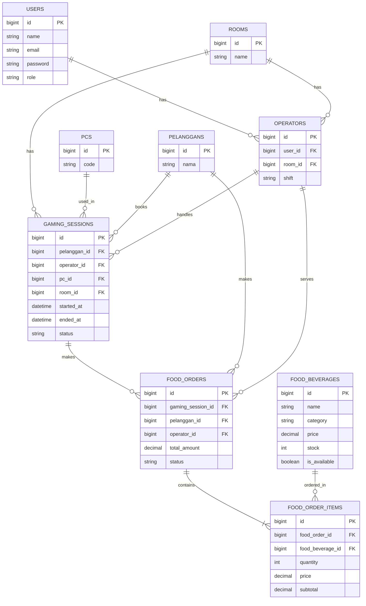

# BAB I
## PENDAHULUAN

### 1.1 Latar Belakang

Perkembangan teknologi informasi telah mendorong berbagai sektor usaha untuk memanfaatkan sistem informasi dalam meningkatkan kualitas pelayanan dan efisiensi operasional. Hal ini juga berlaku pada bidang penyedia jasa hiburan seperti warnet gaming. Pada saat ini, sebagian besar warnet tidak hanya menyediakan fasilitas komputer untuk bermain game, tetapi juga menawarkan layanan tambahan seperti pemesanan makanan dan minuman, pencatatan transaksi, serta pengelolaan data pelanggan.

Pada proyek ini dikembangkan sebuah Sistem Manajemen Warnet Gaming berbasis web menggunakan framework Laravel. Sistem yang telah dibangun sebelumnya telah mampu menangani proses utama, seperti pengelolaan data pelanggan, data komputer (PC), ruangan, sesi bermain (gaming session), pembayaran, serta riwayat permainan. Seluruh data tersebut disimpan pada basis data relasional sehingga proses pengelolaan informasi menjadi lebih terstruktur dibandingkan pencatatan secara manual.

Meskipun demikian, setelah dilakukan analisis terhadap sistem yang telah berjalan, masih ditemukan beberapa kebutuhan yang belum terakomodasi. Salah satunya adalah belum adanya pencatatan mengenai operator yang bertugas melayani pelanggan pada setiap sesi bermain. Akibatnya, pihak pengelola kesulitan mengetahui operator yang bertanggung jawab terhadap suatu transaksi apabila terjadi kendala di kemudian hari.

Selain itu, sistem juga belum menyediakan fitur pengelolaan Food & Beverage (F&B) yang terintegrasi dengan sesi bermain pelanggan. Pada kondisi nyata, pelanggan sering memesan makanan atau minuman ketika sedang bermain. Apabila proses pencatatan pesanan dilakukan secara manual tanpa terhubung dengan sistem utama, risiko kesalahan pencatatan stok, duplikasi pesanan, hingga ketidaksesuaian laporan penjualan menjadi lebih besar.

Berdasarkan permasalahan tersebut, dilakukan pengembangan terhadap skema basis data dan RESTful API dengan menambahkan beberapa modul baru, yaitu Modul Operator dan Modul Food & Beverage. Kedua modul tersebut dirancang agar mampu terintegrasi dengan sistem yang telah ada sehingga proses operasional warnet menjadi lebih efektif, data yang dihasilkan lebih akurat, serta keamanan transaksi dapat ditingkatkan melalui mekanisme validasi, otorisasi pengguna, dan pengelolaan transaksi database (database transaction).

Melalui pengembangan ini diharapkan sistem tidak hanya mampu memenuhi kebutuhan operasional sehari-hari, tetapi juga menjadi contoh implementasi penerapan konsep Basis Data Lanjut dan RESTful API menggunakan Laravel sesuai dengan capaian pembelajaran pada mata kuliah Basis Data Lanjut.

### 1.2 Rumusan Masalah

Berdasarkan latar belakang yang telah dijelaskan, maka rumusan masalah pada pengembangan sistem ini adalah sebagai berikut.

1) Bagaimana merancang perluasan skema basis data agar dapat mendukung pengelolaan operator serta pemesanan makanan dan minuman pada sistem manajemen warnet gaming?

2) Bagaimana merancang RESTful API yang konsisten, aman, dan sesuai dengan standar pengembangan aplikasi berbasis Laravel?

3) Bagaimana menerapkan validasi data, otorisasi pengguna, serta mekanisme transaksi database agar integritas data tetap terjaga?

4) Bagaimana mendokumentasikan API sehingga mudah dipahami, diuji menggunakan Postman, serta siap digunakan untuk proses pengembangan lebih lanjut?

### 1.3 Tujuan Pengembangan

Pengembangan sistem ini memiliki beberapa tujuan, yaitu:

1) Mengembangkan skema basis data dengan menambahkan modul Operator dan Food & Beverage sesuai kebutuhan operasional warnet.

2) Mengimplementasikan RESTful API untuk mendukung proses pengelolaan data operator, sesi bermain, makanan, minuman, dan pemesanan.

3) Menerapkan mekanisme validasi data, autentikasi menggunakan Laravel Sanctum, otorisasi berbasis role, serta transaksi database untuk meningkatkan keamanan sistem.

4) Mengoptimalkan performa aplikasi melalui penggunaan Eager Loading, Query Scope, dan Database Index sehingga proses pengambilan data menjadi lebih efisien.

5) Menyusun dokumentasi API yang lengkap sehingga memudahkan proses pengujian menggunakan Postman maupun proses pengembangan sistem di masa mendatang.

### 1.4 Ruang Lingkup Pengembangan

Agar pembahasan lebih terarah, pengembangan sistem pada proyek ini dibatasi pada beberapa ruang lingkup berikut.

1) Pengembangan dilakukan pada sistem Warnet Gaming yang telah dibangun pada tugas sebelumnya.

2) Penambahan modul Operator untuk mencatat petugas yang menangani setiap sesi bermain.

3) Penambahan modul Food & Beverage untuk mengelola data makanan, minuman, serta transaksi pemesanan.

4) Perancangan dan implementasi RESTful API menggunakan Laravel.

5) Penggunaan autentikasi berbasis Laravel Sanctum.

6) Pengujian endpoint API menggunakan aplikasi Postman dan PHPUnit.

7) Basis data menggunakan MySQL dengan pendekatan relasional dan normalisasi hingga minimal Third Normal Form (3NF).

### 1.5 Gambaran Umum Sistem

Sistem Manajemen Warnet Gaming merupakan aplikasi berbasis web yang dirancang untuk membantu pengelola warnet dalam mengelola aktivitas operasional secara terintegrasi. Melalui sistem ini, administrator dapat mengelola data pelanggan, data komputer, ruangan, operator, sesi bermain, pembayaran, hingga transaksi makanan dan minuman dalam satu platform.

Seluruh proses komunikasi antara aplikasi dan basis data dilakukan melalui RESTful API. Ketika pengguna mengirimkan permintaan (request), misalnya melakukan booking sesi bermain atau memesan makanan, permintaan tersebut akan diterima oleh API Route pada Laravel. Selanjutnya request diproses oleh Controller, kemudian Model berinteraksi dengan basis data menggunakan Eloquent ORM. Setelah proses selesai, sistem akan mengirimkan response dalam format JSON yang dapat ditampilkan pada aplikasi maupun diuji menggunakan Postman.

Alur kerja sistem secara sederhana dapat digambarkan sebagai berikut:

Pengguna
    |
    v
Request melalui Website / Postman
    |
    v
API Route Laravel
    |
    v
API Controller
    |
    v
Eloquent Model
    |
    v
Database MySQL
    |
    v
Response JSON
    |
    v
Pengguna

Arsitektur tersebut memisahkan antara antarmuka pengguna dengan proses bisnis aplikasi sehingga sistem menjadi lebih fleksibel, mudah dikembangkan, dan dapat diintegrasikan dengan berbagai platform, seperti aplikasi web maupun aplikasi mobile.

# BAB II
## PERANCANGAN BASIS DATA

### 2.1 Analisis Kebutuhan Sistem

Sebelum melakukan pengembangan, langkah pertama yang dilakukan adalah menganalisis kebutuhan sistem yang sudah ada. Analisis ini bertujuan untuk mengetahui apakah struktur basis data yang digunakan masih mampu memenuhi kebutuhan operasional warnet atau masih terdapat fitur yang perlu ditambahkan.

Pada sistem sebelumnya, proses utama seperti pengelolaan pelanggan, komputer (PC), ruangan, sesi bermain (gaming session), pembayaran, dan riwayat permainan telah berjalan dengan baik. Namun setelah dilakukan evaluasi, ditemukan beberapa kebutuhan baru yang belum didukung oleh struktur basis data.

#### 2.1.1 Belum adanya pencatatan operator

Pada kondisi nyata, setiap pelanggan biasanya dilayani oleh seorang operator yang bertugas membantu proses peminjaman komputer, memberikan informasi kepada pelanggan, serta menangani berbagai kendala selama sesi bermain berlangsung.

Sayangnya, sistem sebelumnya belum mencatat operator yang bertugas pada setiap sesi bermain. Akibatnya, administrator tidak dapat mengetahui siapa operator yang bertanggung jawab terhadap suatu transaksi apabila terjadi komplain atau kesalahan pencatatan.

Untuk mengatasi permasalahan tersebut, ditambahkan tabel operators dan relasi baru menuju tabel gaming_sessions.

#### 2.1.2 Belum adanya sistem pemesanan makanan dan minuman

Selain bermain game, pelanggan juga sering memesan makanan ataupun minuman. Pada sistem lama, transaksi tersebut belum terintegrasi dengan sistem utama sehingga pencatatan masih dilakukan secara manual.

Cara seperti ini memiliki beberapa kelemahan, di antaranya:

- stok sulit dipantau,
- laporan penjualan tidak terintegrasi,
- rawan terjadi kesalahan pencatatan,
- dua operator dapat mencatat pesanan yang sama secara bersamaan sehingga stok menjadi tidak sesuai.

Untuk mengatasi masalah tersebut, dibuat modul Food & Beverage yang terdiri dari tiga tabel baru, yaitu:

- food_beverages,
- food_orders,
- food_order_items.

Ketiga tabel tersebut saling terhubung sehingga seluruh transaksi makanan dapat dicatat secara otomatis.

#### 2.1.3 Keamanan transaksi

Selain menambah fitur, pengembangan juga difokuskan pada peningkatan keamanan data.

Beberapa mekanisme yang diterapkan antara lain:

- validasi input,
- autentikasi menggunakan Laravel Sanctum,
- otorisasi berbasis role,
- transaksi database (DB Transaction),
- mekanisme penguncian data (lockForUpdate()).

Dengan adanya mekanisme tersebut, integritas data tetap terjaga meskipun terdapat beberapa pengguna yang melakukan transaksi secara bersamaan.

### 2.2 Solusi Pengembangan Basis Data

Berdasarkan hasil analisis kebutuhan, dilakukan pengembangan terhadap skema basis data dengan menambahkan beberapa tabel baru serta memodifikasi tabel yang telah ada.

Secara umum, pengembangan dapat digambarkan sebagai berikut.

| Kondisi Sistem Lama | Solusi Pengembangan |
|---|---|
| Belum ada data operator | Menambahkan tabel operators |
| Belum ada Food & Beverage | Menambahkan tabel food_beverages |
| Belum ada transaksi makanan | Menambahkan tabel food_orders |
| Belum ada detail item pesanan | Menambahkan tabel food_order_items |
| Belum diketahui operator yang menangani sesi | Menambahkan kolom operator_id pada tabel gaming_sessions |
| Belum ada pembatasan role pengguna | Menambahkan atribut role pada tabel users |

Melalui pengembangan tersebut, seluruh aktivitas pelanggan mulai dari melakukan booking komputer hingga memesan makanan dapat dicatat dalam satu sistem yang saling terhubung.

### 2.3 Entity Relationship Diagram (ERD)

Entity Relationship Diagram (ERD) merupakan gambaran hubungan antar tabel pada sebuah basis data. Dengan adanya ERD, proses pengembangan aplikasi menjadi lebih mudah karena setiap relasi antar entitas dapat dipahami dengan jelas.

Pada proyek ini, ERD dikembangkan dari sistem sebelumnya dengan menambahkan modul Operator dan Food & Beverage.

Diagram ERD lengkap dapat dilihat pada lampiran menggunakan kode Mermaid berikut.


(Di bagian ini kita akan menggunakan diagram Mermaid yang sudah dibuat sebelumnya, sehingga tidak perlu digambar ulang.)

Melalui ERD tersebut dapat diketahui beberapa hubungan utama, yaitu:

1) Relasi User dan Operator

Satu akun pengguna (user) dapat digunakan sebagai akun operator.

Relasi:

Users (1)
  |
  └──────────< Operators (N)

2) Relasi Operator dan Gaming Session

Seorang operator dapat menangani banyak sesi bermain. Namun satu sesi bermain hanya memiliki satu operator yang bertugas.

Operator (1)
  |
  └──────────< Gaming Session (N)

3) Relasi Gaming Session dan Food Order

Selama satu sesi bermain, pelanggan dapat melakukan lebih dari satu pemesanan makanan maupun minuman.

Gaming Session (1)

  |

  └──────────< Food Order (N)

4) Relasi Food Order dan Food Order Item

Satu transaksi makanan dapat terdiri atas beberapa jenis makanan atau minuman.

Misalnya:

Order #001

- 2 Mie Goreng
- 1 Es Teh
- 3 Kopi

Karena itulah dibuat tabel food_order_items sebagai tabel detail.

### 2.4 Kamus Data

Kamus data digunakan untuk menjelaskan fungsi setiap tabel beserta atribut yang dimilikinya.

Dengan adanya kamus data, proses pengembangan maupun pemeliharaan sistem menjadi lebih mudah karena setiap kolom memiliki deskripsi yang jelas.

**Tabel Operators**

Tabel ini digunakan untuk menyimpan informasi mengenai operator yang bertugas di warnet.

| Nama Kolom | Tipe Data | Constraint | Keterangan |
|---|---|---|---|
| id | BIGINT | Primary Key | Identitas operator |
| user_id | BIGINT | Foreign Key | Menghubungkan operator dengan akun login |
| room_id | BIGINT | Foreign Key | Ruangan tempat operator bertugas |
| nama | VARCHAR(100) | - | Nama operator |
| shift | ENUM | - | Shift kerja operator |

**Tabel Food Beverages**

Tabel ini menyimpan seluruh daftar makanan dan minuman yang dijual.

| Kolom | Tipe | Keterangan |
|---|---|---|
| id | BIGINT | Primary Key |
| name | VARCHAR | Nama makanan |
| category | ENUM | Jenis makanan |
| price | DECIMAL | Harga |
| stock | INTEGER | Jumlah stok |
| is_available | BOOLEAN | Status tersedia |

### 2.5 Justifikasi Normalisasi

Normalisasi merupakan proses menyusun struktur tabel agar data tersimpan secara efisien dan tidak menimbulkan duplikasi yang tidak diperlukan.

Pada proyek ini, rancangan basis data telah memenuhi Third Normal Form (3NF).

1) First Normal Form (1NF)

Pada tahap ini setiap kolom hanya menyimpan satu nilai.

Sebagai contoh, satu baris pada tabel food_order_items hanya menyimpan satu jenis makanan.

Contoh yang tidak benar:

Order | Isi
---|---
001 | Mie, Kopi, Teh

Contoh yang benar:

Order | Item
---|---
001 | Mie
001 | Kopi
001 | Teh

Dengan cara tersebut data menjadi lebih mudah diproses oleh database.

2) Second Normal Form (2NF)

Seluruh atribut harus bergantung penuh pada Primary Key.

Misalnya pada tabel food_order_items, nilai quantity dan subtotal bergantung pada data item yang sedang dipesan, bukan hanya pada nomor order saja.

Hal ini menghindari pengulangan data yang tidak diperlukan.

3) Third Normal Form (3NF)

Pada tahap ini tidak boleh terdapat ketergantungan transitif.

Sebagai contoh, harga makanan tidak disimpan kembali pada tabel food_orders, tetapi disimpan sebagai subtotal pada tabel detail transaksi.

Dengan demikian apabila harga "Mie Goreng" berubah minggu depan, riwayat transaksi lama tetap menunjukkan harga saat transaksi dilakukan sehingga laporan keuangan tetap konsisten.

### 2.6 Kesimpulan Bab

Berdasarkan hasil analisis kebutuhan dan proses perancangan, dilakukan pengembangan skema basis data dengan menambahkan modul Operator dan Food & Beverage. Penambahan tersebut memungkinkan sistem mengelola aktivitas operasional warnet secara lebih lengkap dibandingkan sistem sebelumnya.

Selain memperluas fitur, rancangan basis data juga memperhatikan aspek kualitas melalui penerapan normalisasi hingga Third Normal Form (3NF), penggunaan foreign key untuk menjaga konsistensi relasi, serta struktur tabel yang mendukung implementasi RESTful API pada tahap berikutnya.

# BAB III
## PERANCANGAN RESTFUL API

### 3.1 Pengertian RESTful API

Pada aplikasi modern, antarmuka (frontend) dan sistem pengolah data (backend) umumnya tidak lagi saling terhubung secara langsung. Keduanya berkomunikasi melalui sebuah perantara yang disebut Application Programming Interface (API).

RESTful API merupakan sekumpulan aturan yang memungkinkan aplikasi saling bertukar data menggunakan protokol HTTP. Pada proyek ini, RESTful API digunakan sebagai penghubung antara aplikasi dengan database sehingga seluruh proses seperti menampilkan data, menambahkan data, mengubah data, maupun menghapus data dilakukan melalui endpoint API.

Sebagai contoh, ketika seorang pelanggan melakukan booking komputer melalui aplikasi, sebenarnya aplikasi tidak langsung menyimpan data ke database. Aplikasi terlebih dahulu mengirimkan request ke endpoint API. Setelah request diterima, server akan melakukan validasi, memproses data, kemudian mengirimkan response dalam format JSON.

Alur komunikasi tersebut dapat digambarkan sebagai berikut.

Pengguna
     |
     v
Website / Postman
     |
     v
HTTP Request
     |
     v
API Route Laravel
     |
     v
Controller
     |
     v
Model (Eloquent ORM)
     |
     v
Database MySQL
     |
     v
JSON Response
     |
     v
Pengguna

Dengan pendekatan ini, backend dapat digunakan oleh berbagai platform sekaligus, seperti website, aplikasi Android, aplikasi iOS, maupun aplikasi desktop, tanpa perlu mengubah logika bisnis yang ada.

### 3.2 Cara Kerja API pada Laravel

Laravel menyediakan file routes/api.php sebagai tempat untuk mendaftarkan seluruh endpoint API.

Ketika sebuah request dikirimkan, Laravel akan mencari route yang sesuai. Selanjutnya route tersebut akan mengarahkan request menuju controller yang bertugas menjalankan proses bisnis aplikasi.

Secara sederhana alurnya adalah sebagai berikut.

Request
      |
      v
routes/api.php
      |
      v
Api Controller
      |
      v
Model
      |
      v
Database
      |
      v
JSON Response

Misalnya terdapat endpoint berikut.
```php
Route::get('/operators', [OperatorController::class, 'index']);
```
Artinya, setiap kali pengguna mengakses endpoint:

GET `/api/operators`

Laravel akan memanggil fungsi index() pada OperatorController untuk mengambil seluruh data operator dari database.

Dengan adanya pemisahan seperti ini, struktur kode menjadi lebih rapi, mudah dipelajari, dan lebih mudah dikembangkan di kemudian hari.

### 3.3 Komponen Utama RESTful API

Sebelum melakukan pengujian menggunakan Postman, terdapat beberapa istilah penting yang perlu dipahami.

**Endpoint**

Endpoint merupakan alamat yang digunakan untuk mengakses suatu layanan API.

Contoh endpoint pada proyek ini antara lain:

`/api/operators`
`/api/gaming-sessions`
`/api/food-orders`

Setiap endpoint memiliki fungsi yang berbeda sesuai kebutuhan sistem.

**Request**

Request adalah permintaan yang dikirimkan oleh client kepada server.

Contohnya ketika pelanggan ingin memesan makanan, aplikasi akan mengirimkan data seperti berikut.
```json
{
    "gaming_session_id": 1,
    "pelanggan_id": 1,
    "items": [
        {
            "food_beverage_id": 2,
            "quantity": 2
        }
    ]
}
```
Data tersebut akan diproses oleh server sebelum disimpan ke database.

Response

Setelah request diproses, server akan memberikan balasan (response).

Contoh response sukses.
```json
{
    "message": "Food order berhasil dibuat",
    "data": {
        "id": 12,
        "status": "pending"
    }
}
```
Apabila terjadi kesalahan, server juga akan mengirimkan response dalam format JSON.

Misalnya.
```json
{
    "message": "The room id field is required."
}
```
Dengan format JSON, aplikasi dapat membaca hasil tersebut secara otomatis.

### 3.4 HTTP Method

RESTful API menggunakan beberapa jenis HTTP Method sesuai dengan tujuan request yang dikirimkan.

Method | Fungsi | Contoh
---|---|---
GET | Mengambil data | Melihat daftar operator
POST | Menambahkan data | Membuat sesi bermain baru
PUT | Mengubah seluruh data | Mengubah data operator
PATCH | Mengubah sebagian data | Mengubah status pesanan
DELETE | Menghapus data | Menghapus operator

Sebagai contoh:

GET `/api/operators`

digunakan untuk menampilkan daftar operator.

Sedangkan:

POST `/api/operators`

digunakan untuk menambahkan operator baru.

Pemilihan HTTP Method yang tepat merupakan salah satu prinsip penting dalam RESTful API karena membuat struktur endpoint menjadi lebih konsisten dan mudah dipahami.

### 3.5 Format Data JSON

Seluruh data pada RESTful API dikirimkan menggunakan format JSON (JavaScript Object Notation).

JSON dipilih karena ringan, mudah dibaca manusia, serta dapat diproses oleh hampir semua bahasa pemrograman.

Contoh sederhana.
```json
{
    "id": 1,
    "nama": "Dhoni",
    "role": "admin"
}
```
Format JSON terdiri atas pasangan key dan value.

Pada contoh di atas:

- id merupakan key dengan nilai 1
- nama merupakan key dengan nilai Dhoni
- role merupakan key dengan nilai admin

### 3.6 Authentication Menggunakan Laravel Sanctum

Tidak semua endpoint dapat diakses oleh semua pengguna.

Pada proyek ini digunakan Laravel Sanctum sebagai sistem autentikasi berbasis Bearer Token.

Prosesnya adalah sebagai berikut.

Login
    |
    v
Server membuat Token
    |
    v
Token dikirim ke User
    |
    v
Token disimpan
    |
    v
Token dikirim pada setiap Request API
    |
    v
Server memverifikasi Token
    |
    v
Request diterima

Apabila token tidak dikirimkan atau token sudah tidak valid, server akan mengembalikan status 401 Unauthorized.

Dengan mekanisme ini, endpoint yang bersifat sensitif menjadi lebih aman karena hanya dapat diakses oleh pengguna yang telah berhasil login.

### 3.7 Otorisasi Berbasis Role

Selain melakukan autentikasi, sistem juga menerapkan otorisasi berbasis role.

Setiap pengguna memiliki hak akses yang berbeda.

Role | Hak Akses
---|---
Admin | Mengelola seluruh data
Operator | Mengelola sesi bermain dan pesanan
Pelanggan | Booking sesi bermain dan memesan makanan

Sebagai contoh, pelanggan tidak diperbolehkan menghapus data operator karena tindakan tersebut hanya boleh dilakukan oleh administrator.

Apabila pengguna mencoba mengakses endpoint yang bukan haknya, server akan mengembalikan status 403 Forbidden.

### 3.8 Pengujian API Menggunakan Postman

Sebelum API digunakan oleh aplikasi, setiap endpoint perlu diuji terlebih dahulu untuk memastikan bahwa endpoint bekerja sesuai dengan yang diharapkan.

Pada proyek ini pengujian dilakukan menggunakan Postman, yaitu aplikasi yang dapat mengirim request HTTP secara langsung ke server.

Langkah-langkah pengujian adalah sebagai berikut.

1) Menjalankan server Laravel menggunakan perintah: php artisan serve
2) Melakukan login untuk memperoleh Bearer Token.
3) Menyalin token hasil login.
4) Membuka aplikasi Postman.
5) Memilih HTTP Method sesuai endpoint yang akan diuji.
6) Memasukkan URL endpoint.
7) Menambahkan Bearer Token pada menu Authorization.
8) Mengisi request body apabila endpoint menggunakan metode POST, PUT, atau PATCH.
9) Menekan tombol Send.
10) Memeriksa response JSON dan status code yang diberikan oleh server.

Dengan menggunakan Postman, seluruh endpoint dapat diuji tanpa harus membuat antarmuka website terlebih dahulu sehingga proses pengembangan menjadi lebih cepat.

### 3.9 Status Code HTTP

Setiap response dari server akan disertai dengan status code yang menunjukkan hasil dari request.

Status Code | Keterangan
---|---
200 OK | Request berhasil diproses
201 Created | Data baru berhasil dibuat
401 Unauthorized | Pengguna belum login atau token tidak valid
403 Forbidden | Pengguna tidak memiliki hak akses
404 Not Found | Data tidak ditemukan
409 Conflict | Terjadi konflik, misalnya stok habis atau PC sedang digunakan
422 Unprocessable Entity | Data gagal divalidasi
500 Internal Server Error | Terjadi kesalahan pada server

Memahami status code sangat penting karena membantu pengembang mengetahui penyebab kegagalan suatu request sehingga proses debugging menjadi lebih mudah.

# BAB IV
## DOKUMENTASI RESTFUL API

### 4.1 Pendahuluan

Setelah proses perancangan basis data selesai dilakukan, tahap berikutnya adalah merancang RESTful API sebagai media komunikasi antara aplikasi dengan database.

RESTful API memungkinkan aplikasi melakukan berbagai operasi seperti menampilkan data, menambahkan data baru, mengubah data, maupun menghapus data melalui endpoint yang telah disediakan. Seluruh endpoint pada proyek ini dikembangkan menggunakan Laravel dan mengikuti prinsip REST sehingga struktur URL, HTTP Method, serta response yang diberikan menjadi konsisten.

Untuk meningkatkan keamanan sistem, seluruh endpoint (kecuali endpoint autentikasi) menggunakan middleware Laravel Sanctum. Dengan demikian, pengguna diwajibkan melakukan login terlebih dahulu untuk memperoleh Bearer Token sebelum dapat mengakses API.

---

### 4.2 Struktur Endpoint

Secara umum endpoint pada sistem dibagi menjadi empat modul utama.

| Modul | Fungsi |
|---|---|
| Operator | Mengelola data operator warnet |
| Gaming Session | Mengelola sesi bermain pelanggan |
| Food & Beverage | Mengelola data makanan dan minuman |
| Food Order | Mengelola transaksi pemesanan makanan |

Masing-masing modul memiliki endpoint yang berbeda sesuai dengan kebutuhan proses bisnis.

---

### 4.3 Modul Operator

Modul ini digunakan untuk mengelola seluruh data operator yang bekerja pada warnet.

Operator bertugas melayani pelanggan, mengawasi sesi bermain, serta mencatat transaksi tertentu.

#### Endpoint 1 — Menampilkan Seluruh Operator

**Tujuan**

Endpoint ini digunakan untuk mengambil seluruh data operator yang tersimpan pada database. Endpoint biasanya digunakan ketika administrator ingin melihat daftar operator yang sedang bertugas.

**Informasi Endpoint**

| Item | Nilai |
|---|---|
| Method | GET |
| URL | `/api/operators` |
| Hak Akses | Admin |
| Authentication | Bearer Token |

**Query Parameter**

| Parameter | Fungsi |
|---|---|
| `room_id` | Menampilkan operator berdasarkan ruangan |
| `shift` | Menampilkan operator berdasarkan shift |

**Contoh Request**

```http
GET /api/operators?shift=pagi
Authorization: Bearer {token}
```

**Response Berhasil**

```json
{
    "data": [
        {
            "id": 1,
            "nama": "Budi",
            "shift": "pagi",
            "room": {
                "id": 1,
                "name": "VIP"
            }
        }
    ]
}
```

**Penjelasan**

Apabila request berhasil diproses, server akan mengembalikan seluruh data operator dalam format JSON. Data yang ditampilkan telah memanfaatkan Eager Loading, sehingga informasi ruangan dapat ditampilkan tanpa melakukan query tambahan ke database.

**Kemungkinan Error**

| Status | Penyebab |
|---|---|
| 401 | Token tidak valid |
| 403 | User bukan admin |

---

#### Endpoint 2 — Menambahkan Operator Baru

**Tujuan**

Endpoint ini digunakan ketika administrator ingin menambahkan operator baru ke dalam sistem.

**Informasi Endpoint**

| Item | Nilai |
|---|---|
| Method | POST |
| URL | `/api/operators` |
| Hak Akses | Admin |

**Request Body**

```json
{
    "user_id": 3,
    "room_id": 1,
    "shift": "pagi"
}
```

**Penjelasan Request**

- `user_id` adalah akun yang akan dijadikan operator.
- `room_id` menunjukkan ruangan tempat operator bertugas.
- `shift` menentukan jadwal kerja operator.

Sebelum data disimpan, Laravel akan memvalidasi bahwa `user_id` dan `room_id` benar-benar tersedia pada database.

**Response Berhasil**

```json
{
    "message": "Operator berhasil ditambahkan",
    "data": {
        "id": 10,
        "shift": "pagi"
    }
}
```

**Kemungkinan Error**

| Status | Penyebab |
|---|---|
| 422 | Data tidak valid |
| 401 | Belum login |
| 403 | Bukan admin |

---

#### Endpoint 3 — Melihat Detail Operator

**Tujuan**

Digunakan untuk melihat informasi lengkap mengenai seorang operator berdasarkan ID.

**Method**

```http
GET /api/operators/{id}
```

Jika operator ditemukan maka server mengembalikan seluruh informasi operator.

Jika tidak ditemukan maka server memberikan:

```json
{
    "message": "Operator tidak ditemukan."
}
```

**Status Code**

`404 Not Found`

---

#### Endpoint 4 — Mengubah Data Operator

Endpoint ini digunakan ketika administrator ingin memperbarui informasi operator, misalnya perubahan shift kerja atau perpindahan ruangan.

**Method**

```http
PUT /api/operators/{id}
```

**Body**

```json
{
    "shift": "malam"
}
```

Apabila proses berhasil maka server mengembalikan data operator terbaru.

---

#### Endpoint 5 — Menghapus Operator

Endpoint ini digunakan apabila data operator sudah tidak digunakan lagi.

**Method**

```http
DELETE /api/operators/{id}
```

Jika berhasil:

```json
{
    "message": "Operator berhasil dihapus."
}
```

---

### 4.4 Modul Gaming Session

Modul Gaming Session merupakan inti dari sistem karena seluruh aktivitas pelanggan dimulai dari proses booking komputer.

Pada modul ini ditambahkan atribut `operator_id` sehingga setiap sesi bermain memiliki informasi mengenai operator yang melayani pelanggan.

#### Endpoint 6 — Booking Sesi Bermain

**Tujuan**

Endpoint ini digunakan ketika pelanggan ingin melakukan booking komputer sebelum bermain.

**Method**

```http
POST /api/booking-sessions
```

**Request**

```json
{
    "pelanggan_id": 1,
    "room_id": 1,
    "pc_id": 1,
    "operator_id": 1
}
```

**Alur Validasi**

Endpoint ini menggunakan validasi bertingkat.

```
Request
   │
   ▼
Validasi Login
   │
   ▼
Validasi Field
   │
   ▼
Validasi Foreign Key
   │
   ▼
Cek Status PC
   │
   ▼
DB Transaction
   │
   ▼
Gaming Session dibuat
   │
   ▼
201 Created
```

**Mengapa menggunakan validasi bertingkat?**

Karena proses booking tidak cukup hanya memeriksa apakah data sudah diisi.

Server juga harus memastikan:

- pelanggan benar-benar ada
- operator tersedia
- ruangan tersedia
- komputer belum dipakai orang lain

Dengan cara tersebut data yang tersimpan menjadi lebih valid dan konsisten.

---

#### Endpoint 7 — Menampilkan Seluruh Gaming Session

**Method**

```http
GET /api/gaming-sessions
```

Endpoint ini mengembalikan daftar seluruh sesi bermain beserta relasi:

- pelanggan
- operator
- room
- pc

melalui fitur Eager Loading.

---

#### Endpoint 8 — Menampilkan Detail Gaming Session

**Tujuan**

Endpoint ini digunakan untuk melihat informasi lengkap dari satu sesi bermain berdasarkan ID. Endpoint ini berguna ketika administrator maupun operator ingin mengetahui detail aktivitas pelanggan pada suatu sesi tertentu.

**Informasi Endpoint**

| Item | Nilai |
|---|---|
| Method | GET |
| URL | `/api/gaming-sessions/{id}` |
| Authentication | Bearer Token |
| Hak Akses | Semua user yang telah login |

**Contoh Request**

```http
GET /api/gaming-sessions/5
Authorization: Bearer {token}
```

**Response Berhasil**

```json
{
    "id": 5,
    "pelanggan": {
        "nama": "Dhoni"
    },
    "room": {
        "name": "VIP"
    },
    "pc": {
        "code": "PC-05"
    },
    "operator": {
        "nama": "Budi"
    },
    "status": "active"
}
```

**Penjelasan**

Data yang dikembalikan tidak hanya berasal dari tabel `gaming_sessions`, tetapi juga menampilkan data pelanggan, operator, ruangan, dan komputer melalui Eager Loading.

Hal tersebut membuat jumlah query database menjadi lebih sedikit sehingga performa aplikasi menjadi lebih baik.

---

#### Endpoint 9 — Menghapus Gaming Session

**Tujuan**

Endpoint ini digunakan untuk menghapus data sesi bermain apabila diperlukan, misalnya ketika terjadi kesalahan pencatatan.

**Informasi Endpoint**

| Item | Nilai |
|---|---|
| Method | DELETE |
| URL | `/api/gaming-sessions/{id}` |
| Hak Akses | Admin, Operator |

**Response Berhasil**

```json
{
    "message": "Gaming session berhasil dihapus."
}
```

**Kemungkinan Error**

| Status | Penyebab |
|---|---|
| 403 | Role pelanggan mencoba menghapus data |
| 404 | Data tidak ditemukan |

---

### 4.5 Modul Food & Beverage

Selain menyediakan layanan bermain game, warnet juga menyediakan berbagai makanan dan minuman bagi pelanggan.

Untuk mendukung proses tersebut, dibuat modul Food & Beverage sehingga administrator dapat mengelola daftar menu beserta stok yang tersedia.

#### Endpoint 10 — Menampilkan Daftar Menu

**Tujuan**

Endpoint ini digunakan untuk menampilkan seluruh makanan dan minuman yang masih tersedia.

**Informasi Endpoint**

| Item | Nilai |
|---|---|
| Method | GET |
| URL | `/api/food-beverages` |
| Authentication | Bearer Token |
| Hak Akses | Semua Role |

**Contoh Request**

```http
GET /api/food-beverages
```

**Response Berhasil**

```json
{
    "data": [
        {
            "id": 1,
            "name": "Mie Goreng",
            "price": 12000,
            "stock": 20
        }
    ]
}
```

**Penjelasan**

Endpoint ini hanya menampilkan menu yang masih aktif menggunakan Query Scope `available()`, sehingga menu yang sudah tidak dijual tidak akan muncul.

---

#### Endpoint 11 — Menambahkan Menu Baru

**Tujuan**

Digunakan administrator untuk menambahkan makanan atau minuman baru.

**Request**

```json
{
    "name": "Mie Goreng",
    "category": "food",
    "price": 12000,
    "stock": 20
}
```

**Validasi**

Sebelum data disimpan sistem akan memeriksa:

- nama menu tidak kosong
- kategori valid
- harga berupa angka
- stok tidak bernilai negatif

Apabila seluruh validasi berhasil maka data akan disimpan ke database.

---

#### Endpoint 12 — Mengubah Data Menu

Endpoint ini digunakan ketika administrator ingin mengubah harga ataupun stok makanan.

**Method**

```http
PUT /api/food-beverages/{id}
```

**Body**

```json
{
    "stock": 15
}
```

---

#### Endpoint 13 — Menghapus Menu

Endpoint ini digunakan apabila makanan sudah tidak dijual lagi.

**Method**

```http
DELETE /api/food-beverages/{id}
```

Jika berhasil server mengembalikan:

`204 No Content`

Status tersebut menunjukkan bahwa proses berhasil tetapi tidak ada data yang dikirim kembali.

---

### 4.6 Modul Food Order

Modul Food Order digunakan untuk mencatat seluruh transaksi makanan maupun minuman yang dilakukan pelanggan selama sesi bermain.

Setiap transaksi akan terhubung dengan:

- pelanggan
- gaming session
- operator
- detail item pesanan

Dengan struktur tersebut seluruh transaksi menjadi lebih mudah dilacak.

#### Endpoint 14 — Membuat Food Order

**Tujuan**

Endpoint ini digunakan ketika pelanggan ingin memesan makanan ataupun minuman.

**Informasi Endpoint**

| Item | Nilai |
|---|---|
| Method | POST |
| URL | `/api/food-orders` |
| Hak Akses | Pelanggan |

**Request**

```json
{
    "gaming_session_id": 1,
    "pelanggan_id": 1,
    "items": [
        {
            "food_beverage_id": 2,
            "quantity": 3
        }
    ]
}
```

**Alur Proses**

Ketika request diterima, server akan melakukan beberapa langkah berikut.

```
Request
   │
   ▼
Validasi Login
   │
   ▼
Validasi Request
   │
   ▼
Cek Gaming Session
   │
   ▼
Cek Stok
   │
   ▼
Lock Data
   │
   ▼
Kurangi Stok
   │
   ▼
Simpan Order
   │
   ▼
Commit Transaction
   │
   ▼
201 Created
```

**Mengapa menggunakan DB Transaction?**

Proses pemesanan makanan melibatkan lebih dari satu tabel.

Misalnya:

- `food_orders`
- `food_order_items`
- `food_beverages`

Apabila salah satu proses gagal, seluruh perubahan akan dibatalkan (Rollback) sehingga tidak terjadi data yang tidak konsisten.

**Mengapa menggunakan `lockForUpdate()`?**

Bayangkan stok Mie Goreng tinggal 1 porsi.

Kemudian dua pelanggan memesan Mie Goreng secara bersamaan.

Tanpa `lockForUpdate()`, kedua transaksi bisa sama-sama membaca stok = 1, lalu keduanya berhasil membeli. Akibatnya stok menjadi -1, padahal secara logika hal tersebut tidak mungkin terjadi.

Dengan `lockForUpdate()`, Laravel akan mengunci sementara baris data makanan yang sedang diproses. Request kedua harus menunggu hingga transaksi pertama selesai, sehingga stok tetap akurat.

**Response Berhasil**

```json
{
    "message": "Food order berhasil dibuat.",
    "status": "pending"
}
```

**Response Gagal (409)**

```json
{
    "message": "Stok tidak mencukupi.",
    "available_stock": 2,
    "requested_quantity": 3
}
```

**Penjelasan**

Status `409 Conflict` digunakan karena data yang dikirim sebenarnya sudah benar, tetapi kondisi database tidak memungkinkan transaksi untuk dilanjutkan.

---

#### Endpoint 15 — Mengubah Status Food Order

Endpoint ini digunakan oleh operator maupun administrator untuk mengubah status pesanan.

Misalnya:

- Pending
- Paid
- Delivered
- Cancelled

**Request**

```json
{
    "status": "delivered"
}
```

**Validasi**

Server hanya menerima empat status yang telah ditentukan.

Apabila pengguna mengirim status selain daftar tersebut, maka server akan mengembalikan `422 Unprocessable Entity`.

---

### 4.7 Ringkasan Seluruh Endpoint

| No | Endpoint | Method | Role |
|---|---|---|---|
| 1 | `/api/operators` | GET | Admin |
| 2 | `/api/operators` | POST | Admin |
| 3 | `/api/operators/{id}` | GET | Admin |
| 4 | `/api/operators/{id}` | PUT | Admin |
| 5 | `/api/operators/{id}` | DELETE | Admin |
| 6 | `/api/booking-sessions` | POST | Pelanggan |
| 7 | `/api/gaming-sessions` | GET | Semua Role |
| 8 | `/api/gaming-sessions/{id}` | GET | Semua Role |
| 9 | `/api/gaming-sessions/{id}` | DELETE | Admin, Operator |
| 10 | `/api/food-beverages` | GET | Semua Role |
| 11 | `/api/food-beverages` | POST | Admin |
| 12 | `/api/food-beverages/{id}` | PUT | Admin |
| 13 | `/api/food-beverages/{id}` | DELETE | Admin |
| 14 | `/api/food-orders` | POST | Pelanggan |
| 15 | `/api/food-orders/{id}/status` | PUT | Admin, Operator |

---

### 4.8 Kesimpulan Bab

Pada bab ini telah dijelaskan seluruh endpoint RESTful API yang dikembangkan pada sistem Warnet Gaming, mulai dari pengelolaan operator, sesi bermain, makanan dan minuman, hingga transaksi pemesanan. Setiap endpoint dirancang mengikuti prinsip REST dengan penggunaan HTTP Method yang sesuai, mekanisme autentikasi menggunakan Laravel Sanctum, serta otorisasi berbasis role.

Selain itu, dokumentasi juga dilengkapi dengan contoh request, response, status code, serta penjelasan proses bisnis pada setiap endpoint. Dengan dokumentasi yang lengkap, proses pengembangan, pengujian menggunakan Postman, maupun pemeliharaan sistem di masa mendatang menjadi lebih mudah dilakukan.

# BAB V
## IMPLEMENTASI RESTFUL API MENGGUNAKAN LARAVEL

### 5.1 Gambaran Implementasi

Setelah proses perancangan basis data dan RESTful API selesai dilakukan, tahap berikutnya adalah mengimplementasikan seluruh rancangan tersebut menggunakan framework Laravel. Framework ini dipilih karena menerapkan pola arsitektur Model-View-Controller (MVC) yang membuat struktur aplikasi menjadi lebih terorganisir, mudah dipelihara, dan mudah dikembangkan.

Pada proyek ini, Laravel berperan sebagai backend yang menangani seluruh proses bisnis aplikasi, mulai dari menerima request dari client, melakukan validasi data, berinteraksi dengan database melalui Eloquent ORM, hingga mengembalikan response dalam format JSON.

Secara umum alur implementasi pada proyek ini dapat digambarkan sebagai berikut.

```
Client (Website/Postman)
          │
          ▼
     API Route
          │
          ▼
     Middleware
          │
          ▼
     Controller
          │
          ▼
 Validation Request
          │
          ▼
     Eloquent Model
          │
          ▼
 Database MySQL
          │
          ▼
 JSON Response
```

Dengan arsitektur tersebut, setiap komponen memiliki tugas masing-masing sehingga kode program menjadi lebih bersih dan mudah dipahami.

---

### 5.2 Implementasi API Route

Pada Laravel, seluruh endpoint API didefinisikan pada file:

```
routes/api.php
```

File ini berfungsi sebagai penghubung antara URL yang diakses pengguna dengan controller yang akan memproses request tersebut.

Contoh implementasi route:

```php
Route::middleware('auth:sanctum')->group(function () {

    Route::apiResource('operators', OperatorController::class);

    Route::apiResource('food-beverages', FoodBeverageController::class);

    Route::apiResource('food-orders', FoodOrderController::class);

});
```

Kode di atas menunjukkan bahwa seluruh endpoint hanya dapat diakses oleh pengguna yang telah berhasil melakukan autentikasi menggunakan Laravel Sanctum.

Keuntungan menggunakan `apiResource()` adalah Laravel secara otomatis membuat endpoint standar seperti:

- GET
- POST
- PUT
- DELETE

sehingga penulisan route menjadi lebih ringkas.

---

### 5.3 Implementasi Migration

Migration digunakan untuk membuat struktur tabel pada database secara otomatis melalui kode program.

Dengan migration, seluruh anggota tim dapat memiliki struktur database yang sama tanpa harus membuat tabel secara manual menggunakan phpMyAdmin.

Sebagai contoh, migration tabel `operators` berisi informasi mengenai kolom, tipe data, serta relasi foreign key terhadap tabel lain.

Contoh sederhana:

```php
Schema::create('operators', function (Blueprint $table) {

    $table->id();

    $table->foreignId('user_id')->constrained();

    $table->foreignId('room_id')->constrained();

    $table->string('shift');

    $table->timestamps();

});
```

Migration dijalankan menggunakan perintah:

```bash
php artisan migrate
```

Dengan cara ini, proses pembuatan database menjadi lebih cepat, konsisten, dan mudah dipelihara.

---

### 5.4 Implementasi Model

Model merupakan representasi dari tabel database di dalam Laravel.

Melalui model, developer dapat melakukan operasi database seperti mengambil data, menyimpan data, mengubah data, maupun menghapus data tanpa harus menulis query SQL secara langsung.

Sebagai contoh, model `Operator` digunakan untuk berinteraksi dengan tabel `operators`.

Beberapa konfigurasi penting pada model antara lain:

#### Fillable

Properti `$fillable` digunakan untuk menentukan kolom yang boleh diisi melalui proses Mass Assignment.

Contoh:

```php
protected $fillable = [

    'user_id',

    'room_id',

    'shift'

];
```

Dengan adanya `$fillable`, Laravel akan menolak kolom lain yang tidak diizinkan sehingga aplikasi menjadi lebih aman.

#### Relationship

Relationship digunakan untuk menggambarkan hubungan antar tabel.

Sebagai contoh:

```php
public function room()
{
    return $this->belongsTo(Room::class);
}
```

Relasi tersebut menunjukkan bahwa setiap operator hanya bertugas pada satu ruangan.

Sedangkan satu ruangan dapat memiliki beberapa operator.

#### Cast

Property `$casts` digunakan untuk mengubah tipe data secara otomatis.

Contoh:

```php
protected $casts = [

    'is_available' => 'boolean'

];
```

Dengan demikian nilai `0` dan `1` pada database akan otomatis berubah menjadi `true` atau `false` ketika dikirim sebagai response JSON.

---

### 5.5 Implementasi Controller

Controller merupakan pusat logika bisnis pada Laravel.

Seluruh request dari client akan diproses terlebih dahulu oleh controller sebelum data disimpan atau diambil dari database.

Sebagai contoh, ketika administrator ingin menambahkan operator baru, alur yang terjadi adalah sebagai berikut.

```
POST /api/operators
        │
        ▼
OperatorController
        │
        ▼
Validasi Request
        │
        ▼
Operator::create()
        │
        ▼
Database
        │
        ▼
JSON Response
```

Dengan cara tersebut, seluruh proses bisnis aplikasi berada pada satu tempat sehingga kode menjadi lebih mudah dipelihara.

---

### 5.6 Implementasi Form Request Validation

Salah satu fitur Laravel yang digunakan pada proyek ini adalah Form Request Validation.

Validasi dilakukan sebelum data diproses sehingga hanya data yang memenuhi aturan yang dapat disimpan ke database.

Contoh aturan validasi:

```php
[
    'room_id' => 'required|exists:rooms,id',

    'user_id' => 'required|exists:users,id',

    'shift' => 'required|in:pagi,siang,malam'
]
```

Melalui validasi tersebut, sistem akan memastikan bahwa:

- seluruh data wajib diisi,
- data mengacu pada foreign key yang benar,
- nilai shift hanya boleh berisi pilihan yang telah ditentukan.

Apabila validasi gagal, Laravel secara otomatis mengembalikan status `422 Unprocessable Entity` beserta pesan kesalahan.

---

### 5.7 Implementasi Query Scope

Pada proyek ini digunakan Query Scope untuk menghindari penulisan query yang sama secara berulang.

Sebagai contoh, pada model `FoodBeverage` dibuat scope untuk menampilkan menu yang masih tersedia.

```php
FoodBeverage::available()->get();
```

Tanpa Query Scope, query yang sama harus ditulis berulang kali pada berbagai controller.

Dengan Query Scope, kode menjadi lebih singkat, konsisten, dan mudah dibaca.

---

### 5.8 Implementasi Eager Loading

Salah satu permasalahan yang sering terjadi pada aplikasi berbasis database adalah N+1 Query Problem.

Sebagai contoh, apabila terdapat 100 sesi bermain dan setiap sesi ingin menampilkan nama operator, maka tanpa Eager Loading Laravel akan menjalankan lebih dari 100 query ke database.

Ilustrasinya sebagai berikut.

**Tanpa Eager Loading**

```
1 Query Gaming Session

+

100 Query Operator

=

101 Query
```

Sedangkan menggunakan Eager Loading:

```php
GamingSession::with([
    'operator',
    'room',
    'pc',
    'customer'
])->get();
```

Laravel hanya menjalankan satu query utama beserta relasi yang diperlukan sehingga performa aplikasi menjadi jauh lebih baik.

---

### 5.9 Implementasi Database Transaction

Beberapa proses pada proyek ini melibatkan lebih dari satu tabel database.

Sebagai contoh ketika pelanggan melakukan pemesanan makanan, sistem harus:

- membuat data order,
- membuat detail item,
- mengurangi stok makanan.

Apabila salah satu proses gagal, seluruh perubahan harus dibatalkan agar data tetap konsisten.

Untuk itu digunakan `DB::transaction()`.

Ilustrasi prosesnya sebagai berikut.

```
Request
   │
   ▼
Mulai Transaction
   │
   ▼
Simpan Food Order
   │
   ▼
Simpan Detail Order
   │
   ▼
Kurangi Stok
   │
   ▼
Berhasil?
   │
   ├── YA   → Commit
   │
   └── TIDAK → Rollback
```

Melalui mekanisme ini, database akan selalu berada pada kondisi yang valid meskipun terjadi kesalahan pada salah satu proses.

---

### 5.10 Kesimpulan Bab

Pada bab ini telah dijelaskan proses implementasi RESTful API menggunakan framework Laravel. Mulai dari pendefinisian route, pembuatan migration, implementasi model dan relationship, penyusunan controller, validasi data, penggunaan Query Scope, Eager Loading, hingga Database Transaction.

Penerapan fitur-fitur tersebut membuat aplikasi tidak hanya mampu menjalankan fungsi yang diharapkan, tetapi juga memiliki struktur kode yang rapi, performa yang baik, serta mampu menjaga konsistensi data selama proses transaksi berlangsung.

# BAB VI
## KEAMANAN DAN OPTIMASI SISTEM

### 6.1 Pendahuluan

Dalam pengembangan sebuah RESTful API, keberhasilan sistem tidak hanya diukur dari kemampuan aplikasi dalam menjalankan fungsi yang diinginkan, tetapi juga dari aspek keamanan, keandalan, serta performanya.

Apabila API tidak dilengkapi dengan mekanisme keamanan yang baik, pengguna yang tidak berwenang dapat mengakses atau bahkan mengubah data penting. Selain itu, proses pengambilan data yang tidak efisien dapat menyebabkan aplikasi menjadi lambat ketika jumlah pengguna maupun data semakin bertambah.

Oleh karena itu, pada proyek ini diterapkan beberapa mekanisme keamanan dan optimasi, di antaranya validasi data, autentikasi menggunakan Laravel Sanctum, otorisasi berbasis role, penggunaan database transaction, Eager Loading, Query Scope, Database Index, serta mekanisme penguncian data menggunakan `lockForUpdate()`.

---

### 6.2 Validasi Data

Validasi merupakan proses pemeriksaan data yang dikirimkan oleh pengguna sebelum data tersebut diproses lebih lanjut.

Tujuan utama validasi adalah memastikan bahwa data yang masuk telah sesuai dengan aturan yang ditentukan sehingga dapat mengurangi risiko kesalahan maupun kerusakan data pada database.

Sebagai contoh, ketika administrator menambahkan operator baru, sistem akan memeriksa beberapa hal berikut.

- Seluruh data wajib diisi.
- `user_id` harus tersedia pada tabel `users`.
- `room_id` harus tersedia pada tabel `rooms`.
- Nilai `shift` hanya boleh berisi pilihan yang telah ditentukan.

Apabila salah satu aturan tidak terpenuhi, Laravel akan menghentikan proses dan mengembalikan response seperti berikut.

```json
{
    "message": "Data yang dikirim tidak valid.",
    "errors": {
        "room_id": [
            "The room id field is required."
        ]
    }
}
```

Dengan mekanisme ini, data yang tersimpan pada database menjadi lebih konsisten dan mengurangi kemungkinan terjadinya kesalahan akibat input yang tidak sesuai.

---

### 6.3 Authentication Menggunakan Laravel Sanctum

Agar API tidak dapat diakses oleh sembarang pengguna, sistem menerapkan autentikasi menggunakan Laravel Sanctum.

Ketika pengguna berhasil login, server akan membuat sebuah Bearer Token. Token tersebut berfungsi sebagai identitas pengguna dan harus dikirimkan pada setiap request menuju endpoint yang dilindungi.

Proses autentikasi dapat digambarkan sebagai berikut.

```
Pengguna Login
       │
       ▼
Server Memverifikasi Akun
       │
       ▼
Bearer Token Dibuat
       │
       ▼
Token Disimpan oleh Client
       │
       ▼
Token Dikirim pada Setiap Request
       │
       ▼
Server Memverifikasi Token
       │
       ▼
Akses Diberikan
```

Apabila token tidak dikirimkan atau sudah tidak berlaku, server akan mengembalikan status `401 Unauthorized`.

---

### 6.4 Authorization Berbasis Role

Selain memastikan pengguna telah login, sistem juga membatasi hak akses berdasarkan peran (role) masing-masing pengguna.

Dengan mekanisme ini, setiap pengguna hanya dapat mengakses fitur yang memang menjadi kewenangannya.

| Role | Hak Akses |
|---|---|
| Admin | Mengelola seluruh data sistem |
| Operator | Mengelola sesi bermain dan pesanan |
| Pelanggan | Melakukan booking dan memesan makanan |

Sebagai contoh, pelanggan tidak diperbolehkan menghapus data operator. Apabila pengguna mencoba mengakses endpoint di luar hak aksesnya, sistem akan mengembalikan status `403 Forbidden`.

Penerapan role seperti ini penting untuk mencegah perubahan data oleh pengguna yang tidak berwenang.

---

### 6.5 Database Transaction

Beberapa proses pada sistem melibatkan lebih dari satu tabel sehingga seluruh proses harus dianggap sebagai satu kesatuan transaksi.

Sebagai contoh, ketika pelanggan memesan makanan, sistem harus:

- Membuat data pada tabel `food_orders`.
- Menyimpan detail pesanan pada tabel `food_order_items`.
- Mengurangi stok pada tabel `food_beverages`.

Apabila salah satu langkah gagal, maka seluruh perubahan harus dibatalkan.

Alur transaksi tersebut dapat digambarkan sebagai berikut.

```
Request
    │
    ▼
Mulai Transaction
    │
    ▼
Simpan Order
    │
    ▼
Simpan Detail
    │
    ▼
Kurangi Stok
    │
    ▼
Berhasil?
    │
    ├── YA   → Commit
    │
    └── TIDAK → Rollback
```

Dengan menggunakan `DB::transaction()`, database tetap berada pada kondisi yang konsisten meskipun terjadi kesalahan di tengah proses.

---

### 6.6 Pencegahan Race Condition

Salah satu masalah yang sering terjadi pada sistem transaksi adalah Race Condition, yaitu kondisi ketika dua pengguna melakukan transaksi terhadap data yang sama pada waktu yang hampir bersamaan.

Misalnya, stok Mie Goreng hanya tersisa satu porsi.

Kemudian dua pelanggan melakukan pemesanan secara bersamaan.

Tanpa mekanisme penguncian, kedua transaksi dapat membaca stok yang sama sehingga keduanya berhasil melakukan pembelian. Akibatnya stok menjadi tidak valid.

Untuk mengatasi masalah tersebut digunakan metode:

```php
lockForUpdate()
```

Ilustrasi prosesnya sebagai berikut.

```
Stok = 1
    │
    ▼
Pelanggan A ──────────► lockForUpdate()
                              │
                              ▼
                     Pelanggan B Menunggu
                              │
                              ▼
                     Transaksi A Selesai
                              │
                              ▼
                 Baru Transaksi B Diproses
```

Dengan cara tersebut, hanya satu transaksi yang dapat mengubah data stok pada satu waktu sehingga jumlah stok tetap akurat.

---

### 6.7 Optimasi Menggunakan Eager Loading

Pada aplikasi yang memiliki banyak relasi antar tabel, pengambilan data secara langsung dapat menyebabkan banyak query ke database.

Sebagai contoh, apabila terdapat 100 data sesi bermain dan setiap data memerlukan informasi operator, maka tanpa optimasi Laravel dapat menjalankan lebih dari 100 query.

Untuk mengatasi masalah tersebut digunakan Eager Loading.

```php
GamingSession::with([
    'operator',
    'room',
    'customer',
    'pc'
])->get();
```

Dengan Eager Loading, Laravel mengambil seluruh data yang dibutuhkan dalam jumlah query yang lebih sedikit sehingga waktu eksekusi menjadi lebih cepat.

---

### 6.8 Optimasi Menggunakan Query Scope

Pada beberapa controller terdapat query yang digunakan secara berulang.

Sebagai contoh, untuk mengambil makanan yang masih tersedia.

**Tanpa Query Scope:**

```php
FoodBeverage::where('is_available', true)->get();
```

**Dengan Query Scope:**

```php
FoodBeverage::available()->get();
```

Penggunaan Query Scope membuat kode lebih singkat, mudah dipahami, dan mengurangi kemungkinan kesalahan akibat penulisan query yang berulang.

---

### 6.9 Optimasi Database Menggunakan Index

Selain optimasi pada sisi aplikasi, optimasi juga dilakukan pada sisi database menggunakan Database Index.

Index dibuat pada kolom yang sering digunakan dalam proses pencarian maupun relasi antar tabel.

Contohnya:

- `operator_id`
- `gaming_session_id`
- `food_beverage_id`
- `room_id`
- `user_id`

Dengan adanya index, database tidak perlu membaca seluruh isi tabel ketika melakukan pencarian sehingga proses query menjadi lebih cepat, terutama ketika jumlah data terus bertambah.

---

### 6.10 Penanganan Error

Setiap endpoint pada sistem dirancang agar memberikan response yang konsisten ketika terjadi kesalahan.

Beberapa status code yang digunakan antara lain:

| Status Code | Arti |
|---|---|
| 400 Bad Request | Format request tidak sesuai |
| 401 Unauthorized | Token tidak valid atau belum login |
| 403 Forbidden | Tidak memiliki hak akses |
| 404 Not Found | Data tidak ditemukan |
| 409 Conflict | Konflik data, misalnya stok habis |
| 422 Unprocessable Entity | Validasi gagal |
| 500 Internal Server Error | Terjadi kesalahan pada server |

Dengan response yang konsisten, proses debugging menjadi lebih mudah karena pengembang dapat langsung mengetahui penyebab kegagalan suatu request.

---

### 6.11 Kesimpulan Bab

Berdasarkan implementasi yang telah dilakukan, sistem tidak hanya mampu menjalankan fungsi operasional sesuai kebutuhan, tetapi juga menerapkan berbagai mekanisme keamanan dan optimasi untuk menjaga kualitas aplikasi.

Penerapan validasi data, autentikasi menggunakan Laravel Sanctum, otorisasi berbasis role, Database Transaction, `lockForUpdate()`, Query Scope, Eager Loading, dan Database Index menjadikan RESTful API lebih aman, lebih cepat, serta mampu menjaga konsistensi data ketika digunakan oleh banyak pengguna secara bersamaan.

# BAB VII
## PENGUJIAN SISTEM

### 7.1 Pendahuluan

Setelah seluruh RESTful API berhasil diimplementasikan, tahap berikutnya adalah melakukan pengujian untuk memastikan bahwa setiap endpoint berjalan sesuai dengan kebutuhan sistem.

Pengujian dilakukan untuk memverifikasi beberapa aspek, antara lain:

- Endpoint dapat diakses sesuai URL yang telah ditentukan.
- Validasi request berjalan dengan benar.
- Hak akses pengguna diterapkan sesuai role.
- Response yang dikirim server sesuai dengan standar RESTful API.
- Data berhasil tersimpan, diperbarui, maupun dihapus dari database.
- Penanganan error berjalan sebagaimana mestinya.

Pada proyek ini, pengujian dilakukan menggunakan Postman untuk menguji endpoint secara langsung serta PHPUnit untuk memastikan fungsi-fungsi penting dapat berjalan secara otomatis.

---

### 7.2 Pengujian Menggunakan Postman

Postman digunakan sebagai alat untuk mengirim request HTTP secara langsung ke server tanpa memerlukan antarmuka website.

Melalui Postman, pengembang dapat menguji endpoint satu per satu dan melihat response yang diberikan oleh server dalam format JSON.

Sebelum melakukan pengujian, server Laravel dijalankan menggunakan perintah berikut.

```bash
php artisan serve
```

Kemudian pengguna melakukan login untuk memperoleh Bearer Token yang digunakan sebagai autentikasi pada endpoint yang dilindungi.

---

### 7.3 Langkah Pengujian

Langkah-langkah pengujian yang dilakukan menggunakan Postman adalah sebagai berikut.

#### 1. Login

Endpoint login dipanggil terlebih dahulu untuk memperoleh Bearer Token.

```http
POST /api/login
```

**Response:**

```json
{
    "token": "1|xxxxxxxxxxxxxxxxxxxxxxxx"
}
```

Token tersebut kemudian disalin ke menu Authorization pada Postman menggunakan tipe Bearer Token.

#### 2. Menguji Endpoint GET

Sebagai contoh dilakukan pengujian endpoint:

```http
GET /api/operators
```

**Tujuan pengujian:**

- memastikan endpoint dapat diakses,
- memastikan data berhasil diambil dari database,
- memastikan relasi berhasil dimuat menggunakan Eager Loading.

**Hasil yang diharapkan:**

Status Code: `200 OK`

```json
{
    "data": [
        {
            "id": 1,
            "nama": "Budi"
        }
    ]
}
```

#### 3. Menguji Endpoint POST

Pengujian dilakukan dengan mengirim data operator baru.

**Request Body:**

```json
{
    "user_id": 5,
    "room_id": 1,
    "shift": "pagi"
}
```

Apabila seluruh validasi berhasil maka server mengembalikan `201 Created` beserta data operator yang baru dibuat.

#### 4. Menguji Endpoint PUT

Pengujian dilakukan untuk memastikan data dapat diperbarui.

**Contoh:**

```http
PUT /api/operators/5
```

**Body:**

```json
{
    "shift": "malam"
}
```

**Hasil yang diharapkan:**

- data berubah pada database,
- response menampilkan data terbaru.

#### 5. Menguji Endpoint DELETE

Endpoint DELETE digunakan untuk memastikan data dapat dihapus.

**Contoh:**

```http
DELETE /api/operators/5
```

Apabila berhasil: `204 No Content`

---

### 7.4 Pengujian Validasi

Selain menguji kondisi normal, dilakukan pula pengujian terhadap data yang tidak valid.

Sebagai contoh:

**Request:**

```json
{
    "room_id": ""
}
```

**Response:**

```json
{
    "message": "The given data was invalid.",
    "errors": {
        "room_id": [
            "The room id field is required."
        ]
    }
}
```

**Status:** `422 Unprocessable Entity`

Pengujian ini menunjukkan bahwa Laravel berhasil menolak data yang tidak memenuhi aturan validasi.

---

### 7.5 Pengujian Hak Akses

Untuk memastikan keamanan API, dilakukan pengujian terhadap endpoint yang hanya boleh diakses oleh role tertentu.

Sebagai contoh, akun pelanggan mencoba mengakses endpoint:

```http
DELETE /api/operators/3
```

Server mengembalikan: `403 Forbidden`

Hal tersebut menunjukkan bahwa middleware role telah bekerja sesuai dengan yang diharapkan.

---

### 7.6 Pengujian Authentication

Pengujian berikutnya dilakukan dengan mengakses endpoint tanpa mengirimkan Bearer Token.

**Contoh:**

```http
GET /api/operators
```

Tanpa Authorization Header.

**Response:** `401 Unauthorized`

Dengan hasil tersebut dapat disimpulkan bahwa endpoint yang dilindungi tidak dapat diakses oleh pengguna yang belum login.

---

### 7.7 Pengujian Database Transaction

Pengujian dilakukan pada endpoint:

```http
POST /api/food-orders
```

**Skenario:**

- stok makanan = 2
- pelanggan memesan = 3

**Response:**

```json
{
    "message": "Stok tidak mencukupi."
}
```

**Status:** `409 Conflict`

Kemudian dilakukan pengecekan database.

**Hasilnya:**

- tidak ada order baru,
- stok tetap 2.

Hal tersebut menunjukkan bahwa Rollback Transaction berhasil dijalankan sehingga database tetap konsisten.

---

### 7.8 Pengujian Race Condition

Pengujian dilakukan dengan mengirim dua request secara hampir bersamaan terhadap stok makanan yang sama.

**Skenario:**

- Stok Awal = 1
- Request A = 1
- Request B = 1

**Hasil:**

- Request pertama berhasil diproses.
- Request kedua ditolak karena stok telah habis.

Pengujian ini menunjukkan bahwa penggunaan `lockForUpdate()` berhasil mencegah terjadinya Race Condition.

---

### 7.9 Pengujian Menggunakan PHPUnit

Selain menggunakan Postman, Laravel juga menyediakan framework PHPUnit untuk melakukan pengujian otomatis (automated testing).

Beberapa pengujian yang dapat dilakukan antara lain:

- Login API
- CRUD Operator
- CRUD Food Beverage
- Booking Gaming Session
- Food Order

Pengujian dijalankan menggunakan perintah:

```bash
php artisan test
```

Apabila seluruh pengujian berhasil, Laravel akan menampilkan hasil seperti berikut.

```
PASS Tests\Feature\OperatorTest
PASS Tests\Feature\FoodOrderTest
PASS Tests\Feature\GamingSessionTest

Tests: 15 passed
```

Hasil tersebut menunjukkan bahwa seluruh fitur yang diuji berjalan sesuai dengan yang diharapkan.

---

### 7.10 Ringkasan Hasil Pengujian

| No | Pengujian | Hasil |
|---|---|---|
| 1 | Login API | Berhasil |
| 2 | GET Operator | Berhasil |
| 3 | POST Operator | Berhasil |
| 4 | PUT Operator | Berhasil |
| 5 | DELETE Operator | Berhasil |
| 6 | GET Food Beverage | Berhasil |
| 7 | POST Food Order | Berhasil |
| 8 | Validation | Berhasil |
| 9 | Authentication | Berhasil |
| 10 | Authorization | Berhasil |
| 11 | Database Transaction | Berhasil |
| 12 | Race Condition | Berhasil |

---

### 7.11 Kesimpulan Bab

Berdasarkan hasil pengujian yang telah dilakukan, seluruh endpoint RESTful API dapat berfungsi sesuai dengan rancangan yang telah dibuat. Pengujian menggunakan Postman menunjukkan bahwa proses CRUD, validasi, autentikasi, serta otorisasi berjalan dengan baik. Selain itu, pengujian terhadap `DB::transaction()` dan `lockForUpdate()` membuktikan bahwa sistem mampu menjaga konsistensi data ketika terjadi transaksi secara bersamaan.

# BAB VIII
## PENUTUP

### 8.1 Kesimpulan

Berdasarkan hasil analisis, perancangan, implementasi, dan pengujian yang telah dilakukan, dapat disimpulkan bahwa pengembangan RESTful API pada Sistem Manajemen Warnet Gaming berhasil memenuhi tujuan yang telah ditetapkan.

Pengembangan diawali dengan melakukan analisis terhadap sistem yang telah ada. Dari hasil analisis tersebut ditemukan beberapa kebutuhan baru, yaitu pencatatan operator yang bertugas serta pengelolaan transaksi makanan dan minuman yang sebelumnya belum tersedia pada sistem. Untuk memenuhi kebutuhan tersebut dilakukan pengembangan skema basis data dengan menambahkan beberapa tabel baru, yaitu `operators`, `food_beverages`, `food_orders`, dan `food_order_items`, serta melakukan penyesuaian relasi pada tabel yang telah ada.

Setelah proses perancangan basis data selesai, dilakukan implementasi RESTful API menggunakan framework Laravel. Seluruh endpoint dikembangkan mengikuti prinsip REST dengan penggunaan HTTP Method yang sesuai, seperti GET, POST, PUT, dan DELETE. Selain itu, komunikasi antara client dan server menggunakan format JSON, sehingga API dapat digunakan oleh berbagai jenis aplikasi, baik web maupun mobile.

Pada aspek keamanan, sistem menerapkan autentikasi menggunakan Laravel Sanctum serta otorisasi berbasis role sehingga hanya pengguna yang memiliki hak akses yang dapat menggunakan endpoint tertentu. Validasi data juga diterapkan pada setiap request untuk memastikan bahwa data yang disimpan telah sesuai dengan aturan yang ditentukan.

Dari sisi performa, dilakukan beberapa optimasi seperti penggunaan Eager Loading, Query Scope, Database Index, `DB::transaction()`, dan `lockForUpdate()`. Penerapan teknik-teknik tersebut membantu meningkatkan efisiensi proses pengambilan data sekaligus menjaga konsistensi database ketika terjadi transaksi secara bersamaan.

Berdasarkan hasil pengujian menggunakan Postman dan PHPUnit, seluruh endpoint berhasil dijalankan sesuai dengan kebutuhan sistem. Proses CRUD, autentikasi, validasi, otorisasi, serta transaksi database dapat berjalan dengan baik sehingga RESTful API yang dikembangkan dinilai telah memenuhi kebutuhan fungsional maupun nonfungsional pada sistem manajemen warnet gaming.

Secara keseluruhan, proyek ini memberikan pengalaman dalam menerapkan konsep Basis Data Lanjut, RESTful API, serta praktik pengembangan aplikasi menggunakan Laravel mulai dari tahap perancangan hingga proses pengujian.

---

### 8.2 Kelebihan Sistem

Berdasarkan hasil implementasi yang telah dilakukan, sistem memiliki beberapa kelebihan sebagai berikut.

- Menggunakan arsitektur RESTful API sehingga mudah diintegrasikan dengan berbagai platform.
- Struktur basis data telah dinormalisasi hingga Third Normal Form (3NF) sehingga mengurangi redundansi data.
- Menggunakan autentikasi berbasis Laravel Sanctum untuk meningkatkan keamanan akses API.
- Mendukung otorisasi berdasarkan role sehingga setiap pengguna memiliki hak akses yang sesuai.
- Menggunakan Database Transaction untuk menjaga konsistensi data pada proses transaksi.
- Menggunakan Eager Loading dan Query Scope sehingga performa aplikasi menjadi lebih optimal.
- Dokumentasi endpoint disusun secara lengkap sehingga memudahkan proses pengembangan maupun pengujian.

---

### 8.3 Keterbatasan Sistem

Meskipun sistem telah berjalan dengan baik, masih terdapat beberapa keterbatasan yang dapat menjadi bahan evaluasi pada pengembangan berikutnya.

- Sistem belum menyediakan notifikasi secara real-time ketika terdapat pesanan makanan baru.
- Dashboard analisis penjualan dan statistik penggunaan komputer masih terbatas.
- Belum tersedia fitur pembayaran digital yang terintegrasi dengan payment gateway.
- Dokumentasi API masih disusun secara manual dan belum menggunakan generator dokumentasi seperti Swagger atau OpenAPI.
- Sistem masih berfokus pada backend sehingga antarmuka pengguna belum memanfaatkan framework frontend modern seperti Vue.js atau React.

---

### 8.4 Saran Pengembangan

Beberapa pengembangan yang dapat dilakukan pada masa mendatang antara lain sebagai berikut.

**Integrasi Mobile Application**

RESTful API yang telah dikembangkan dapat dimanfaatkan sebagai backend untuk aplikasi Android maupun iOS sehingga pelanggan dapat melakukan booking komputer secara langsung melalui perangkat seluler.

**Dashboard Monitoring**

Menambahkan dashboard yang menampilkan informasi secara real-time, seperti jumlah komputer yang sedang digunakan, jumlah pelanggan aktif, pendapatan harian, serta stok makanan dan minuman.

**Pembayaran Digital**

Mengintegrasikan sistem dengan layanan pembayaran digital agar pelanggan dapat melakukan transaksi secara lebih praktis dan aman.

**Dokumentasi API Otomatis**

Menggunakan Swagger atau OpenAPI untuk menghasilkan dokumentasi API secara otomatis sehingga dokumentasi selalu sesuai dengan perubahan kode program.

**Caching**

Menerapkan Redis atau mekanisme caching lainnya untuk mempercepat proses pengambilan data yang sering diakses.

**Logging dan Monitoring**

Menambahkan sistem logging dan monitoring seperti Laravel Telescope atau Sentry untuk memudahkan proses pemantauan performa aplikasi dan penanganan error.

---

### 8.5 Penutup

Pengembangan RESTful API pada Sistem Manajemen Warnet Gaming merupakan penerapan nyata dari materi yang dipelajari pada mata kuliah Basis Data Lanjut, khususnya mengenai pengembangan basis data relasional, implementasi RESTful API, optimasi query, serta pengelolaan transaksi database menggunakan Laravel.

Melalui proyek ini, penulis memperoleh pengalaman dalam merancang struktur basis data, membangun endpoint API, menerapkan autentikasi dan otorisasi, melakukan optimasi performa, hingga menguji aplikasi menggunakan Postman dan PHPUnit. Pengalaman tersebut memberikan pemahaman yang lebih mendalam mengenai proses pengembangan aplikasi backend yang sesuai dengan kebutuhan dunia industri.

Dengan adanya dokumentasi ini, diharapkan proses pengembangan maupun pemeliharaan sistem pada masa mendatang dapat dilakukan dengan lebih mudah serta menjadi referensi bagi pengembang lain yang ingin melanjutkan pengembangan aplikasi.