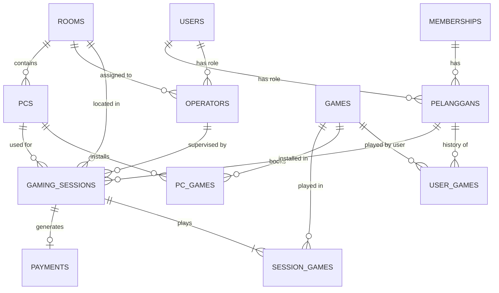

# LAPORAN UJIAN AKHIR SEMESTER - BASIS DATA LANJUT

## 1. Latar Belakang Kebutuhan Fitur & Solusi (Studi Kasus Warnet Gaming)
Berdasarkan "Laporan Sistem Manajemen Warnet Gaming" (sistem berjalan), pencatatan penyewaan PC, durasi bermain, serta transaksi pembayaran telah terkomputerisasi. Namun, untuk menunjang akuntabilitas operasional, diperlukan **pelacakan petugas/operator** yang bertanggung jawab pada saat sesi bermain berlangsung di suatu ruangan. 

**Solusi Perluasan Skema (Modul Operator):**
Melakukan *extend* skema dengan menambahkan:
1. Entitas baru: **`operators`** (Petugas / Karyawan warnet yang memiliki shift dan ditugaskan menjaga `rooms` tertentu).
2. Modifikasi entitas eksisting: Menambahkan foreign key `operator_id` ke dalam tabel transaksi **`gaming_sessions`** (atau `session`).

---

## 2. Kamus Data & Justifikasi Normalisasi (D.1)

### Kamus Data Tabel Baru & Modifikasi
**Tabel `operators` (Penambahan Baru)**
- `id` (BIGINT, PK): Identitas unik setiap petugas warnet.
- `user_id` (BIGINT, FK): Relasi ke tabel `users` untuk login kredensial.
- `room_id` (BIGINT, FK): Ruangan yang dijaga operator (Opsional/Bisa pindah ruangan).
- `nama` (VARCHAR, 100): Nama lengkap operator (atau diambil via `users.name`).
- `shift` (ENUM: 'pagi', 'siang', 'malam'): Jadwal kerja.

**Tabel `gaming_sessions` (Modifikasi Skema Lama)**
- Penambahan kolom: `operator_id` (BIGINT, FK) yang merujuk ke tabel `operators`. Berfungsi untuk mencatat siapa yang melakukan *approve* atau melayani sesi tersebut.

### Justifikasi Normalisasi 3NF
Desain perluasan di atas memenuhi kaidah **3NF**:
1. **1NF**: Atribut `shift` dan `room_id` bernilai atomik. Tidak ada *repeating group* jadwal.
2. **2NF**: Seluruh kolom *non-key* pada tabel `operators` bergantung sepenuhnya pada *primary key* (`id`), bukan pada porsi lain.
3. **3NF**: Tidak ada ketergantungan transitif. Detail ruangan (seperti nama ruangan dan tipe) tidak disimpan di tabel `operators`, melainkan hanya direferensikan via `room_id`. Hal ini konsisten dengan arsitektur awal sistem.

---

## 3. Keamanan, Optimasi, dan Concurrency (D.4)

- **Indexing**: 
  1. Dibuat index pada kolom `operator_id` di tabel `gaming_sessions`. **Justifikasi**: Query dashboard laporan shift harian sangat sering melakukan *filtering* sesi berdasarkan operator (contoh: menghitung total uang yang dipegang Budi di shift Pagi).
  2. Dibuat index pada kolom `room_id` di tabel `operators`. **Justifikasi**: Mempercepat load data saat menampilkan siapa saja operator yang sedang aktif di ruangan "VIP".
- **Validasi Input**: Validasi Input Form Request digunakan secara ketat pada seluruh endpoint API (seperti `/api/booking-sessions`). Aturan `exists:operators,id` memastikan bahwa `operator_id` yang di-*submit* saat pembuatan sesi bermain benar-benar ada di database untuk mencegah *SQL constraint violation*.
- **Otorisasi Berbasis Role**: Autentikasi berbasis token dengan **Laravel Sanctum**. Hak akses dibatasi melalui *middleware* mengecek role user (`admin`, `operator`, `pelanggan`). Seorang pelanggan tidak bisa memanipulasi *shift* operator.

---

## 4. Alur Validasi Berlapis (Multi-step Validation) API Booking Sesi
Saat endpoint API utama sistem ini, yaitu **POST `/api/booking-sessions`** dieksekusi:

| Langkah | Aksi Validasi | Respons jika Gagal |
| --- | --- | --- |
| 1 | Cek Token (Sanctum) | **401 Unauthorized** |
| 2 | Cek tipe data body & *Required fields* | **422 Unprocessable Entity** |
| 3 | Cek ketersediaan referensi (Rule `exists` untuk `pelanggan_id`, `pc_id`, `room_id`, `operator_id`) | **422 Unprocessable Entity** |
| 4 | Cek status PC (tidak boleh sedang 'dipakai') via logic controller / rule kustom. | **409 Conflict** |
| 5 | Insert tabel `gaming_sessions` | **500 Server Error** (Jika database down) |
| 6 | Transaksi sukses | **201 Created** |

---

## 5. ERD FINAL (Menyertakan Perluasan)

Berikut adalah diagram relasi final (Skema Lama 11 Tabel + Perluasan Operator):



---

## 6. DOKUMENTASI API & HASIL PENGUJIAN (TESTING)

Bagian ini difokuskan pada pengujian arsitektur *WarnetGaming* yang telah mengintegrasikan modul baru tersebut, diuji secara otomatis via **`WarnetGamingApiTest.php`**.

### Endpoint Utama
1. **POST `/api/booking-sessions`**
   - **Tujuan**: Membuat sesi penyewaan baru beserta pencatatan *operator* yang bertugas.
   - **Body**: `{ "pelanggan_id": 1, "room_id": 1, "pc_id": 1, "operator_id": 1 }`
   - **Response**: `201 Created`
2. **GET `/api/gaming-sessions`**
   - **Tujuan**: Membaca daftar sesi.
   - **Optimasi**: Menggunakan Eager Loading `with(['pelanggan', 'pc', 'room', 'operator'])` untuk mengatasi N+1 queries.

### Bukti Kelulusan Test (PHPUnit)
Pengujian otomatis dieksekusi dengan `php artisan test --filter WarnetGamingApiTest` dengan *RefreshDatabase* trait:

```text
   PASS  Tests\Feature\WarnetGamingApiTest
  ✓ can create gaming session with valid data
  ✓ validation fails for invalid foreign keys on gaming session
  ✓ can fetch gaming sessions with eager loaded relations
```

1. Skenario Sukses: Pengujian memastikan sesi dibuat dan memvalidasi eksistensi relasi baru `operator_id`.
2. Skenario Validasi: Memastikan `pelanggan_id` atau `operator_id` fiktif akan ditolak (`422 Validation Error`).
3. Skenario *Eager Loading*: Memastikan format JSON yang dikembalikan *API* sudah mengandung *nested object* `operator` dan relasi lainnya.