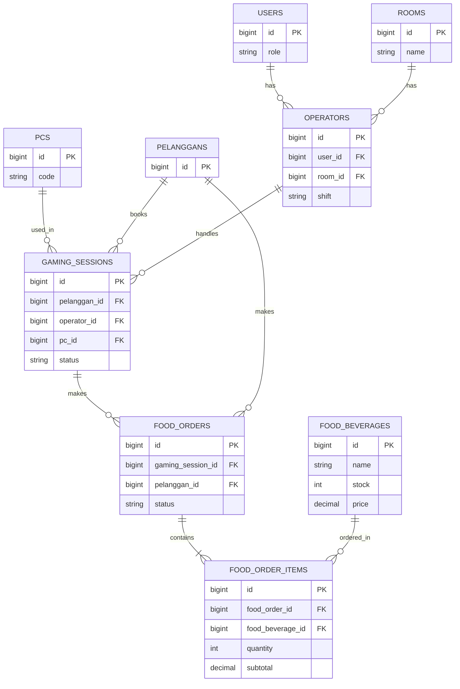

# LAPORAN UAS BASIS DATA LANJUT
## SISTEM MANAJEMEN WARNET GAMING

Laporan ini disusun untuk memenuhi komponen evaluasi proyek akhir (UAS) mata kuliah Basis Data Lanjut.

---

### D.5. Laporan Singkat
**1. Latar Belakang Kebutuhan Fitur**
Sistem Warnet Gaming sebelumnya sudah dapat menangani booking PC dan sesi bermain. Namun, terdapat dua celah utama: tidak adanya pelacakan mengenai **Operator** yang bertugas (kasir) untuk tiap sesi, serta pencatatan pemesanan **makanan/minuman (Food & Beverage)** yang masih manual. Hal ini rentan menyebabkan kebocoran stok dan ketidakjelasan penanggung jawab transaksi.

**2. Rancangan Solusi**
Sistem diperluas dengan menambahkan modul Operator dan modul Food & Beverage. Skema basis data ditambahkan tabel `operators`, `food_beverages`, `food_orders`, dan `food_order_items`. Di sisi backend, dikembangkan lebih dari 8 endpoint RESTful API berbasis Laravel yang mengintegrasikan autentikasi Sanctum, otorisasi role, dan *database transactions*.

**3. Kendala Teknis yang Dihadapi**
Kendala utama yang ditemukan adalah potensi *race condition* (duplikasi pemesanan) ketika dua pelanggan memesan makanan dengan sisa stok 1 secara bersamaan. Solusinya adalah mengimplementasikan metode `lockForUpdate()` (Pessimistic Locking) dan membungkusnya di dalam `DB::transaction()` agar stok tetap konsisten dan akurat.

**4. Cara Pengujian**
Pengujian dilakukan dengan dua pendekatan:
- **Manual (Postman):** Menguji HTTP Request (GET, POST, PUT, DELETE) dengan membawa Bearer Token untuk memvalidasi *response status code* (200, 201, 401, 403, 404, 409, 422).
- **Otomatis (PHPUnit):** Menjalankan *Feature Test* bawaan Laravel (`php artisan test`) untuk menyimulasikan skenario sukses maupun gagal (misal: gagal validasi stok).

---

### D.1. Perancangan Skema Basis Data Lanjutan
**1. Entity Relationship Diagram (ERD) Final**

**2. Kamus Data (Tabel Baru Utama)**
| Tabel | Kolom | Tipe Data | Constraint | Keterangan |
|---|---|---|---|---|
| `operators` | id, user_id, room_id, shift | BIGINT, VARCHAR | PK, FK (users), FK (rooms) | Petugas jaga |
| `food_beverages` | id, name, price, stock | BIGINT, VARCHAR, DECIMAL, INT | PK | Master menu |
| `food_orders` | id, gaming_session_id, status | BIGINT, VARCHAR | PK, FK (gaming_sessions) | Transaksi F&B |
| `food_order_items` | id, food_order_id, food_beverage_id, qty, subtotal | BIGINT, INT, DECIMAL | PK, FK (food_orders, food_beverages) | Detail transaksi |

**3. Justifikasi Normalisasi (Minimal 3NF)**
- **1NF:** Semua atribut bernilai atomik (misalnya, list pesanan dipisah menjadi baris tersendiri di `food_order_items`, tidak digabung dalam satu teks/array).
- **2NF:** Atribut `quantity` dan `subtotal` sepenuhnya bergantung pada kombinasi _Primary Key_ di tabel `food_order_items`.
- **3NF:** Tidak ada *transitive dependency*. Harga item pada saat transaksi disimpan sebagai `subtotal` (hasil kali `price` x `qty`) di `food_order_items`. Hal ini mencegah anomali perubahan riwayat transaksi lama apabila harga master di `food_beverages` mengalami kenaikan suatu saat nanti.

---

### D.2. Perancangan RESTful API
**1. 8 Endpoint Baru**
| Method | Path | Role | Req. Body | Resp. Sukses | Status |
|---|---|---|---|---|---|
| GET | `/api/operators` | Admin | - | List Operator (JSON) | 200 OK |
| POST | `/api/operators` | Admin | user_id, room_id, shift | Data tersimpan | 201 Created |
| GET | `/api/food-beverages` | Semua | - | List Menu & Stok | 200 OK |
| POST | `/api/food-beverages` | Admin | name, category, price | Data menu baru | 201 Created |
| GET | `/api/food-orders` | Admin/Operator | - | List Transaksi F&B | 200 OK |
| POST | `/api/food-orders` | Pelanggan | session_id, items[] | Order terbuat | 201 Created |
| PUT | `/api/food-orders/{id}/status` | Admin/Operator | status (paid/delivered) | Status berubah | 200 OK |
| POST | `/api/booking-sessions` | Pelanggan | pc_id, operator_id | Booking tercatat | 201 Created |

**2. Alur Validasi Berlapis (Contoh Kasus: POST `/api/food-orders`)**
| No | Tahapan Validasi | Respons jika Gagal | Status Code |
|---|---|---|---|
| 1 | Cek Token Sanctum (Login) | `{"message": "Unauthenticated"}` | 401 Unauthorized |
| 2 | Cek Role (Otorisasi) | `{"message": "This action is unauthorized."}` | 403 Forbidden |
| 3 | Validasi Input (Form Request) | `{"errors": {"items": "required"}}` | 422 Unprocessable |
| 4 | Ketersediaan Stok Item | `{"message": "Stok tidak mencukupi."}` | 409 Conflict |
| 5 | Transaksi Commit | *Data tersimpan di DB* | 201 Created |

---

### D.4. Keamanan dan Optimasi
**1. Mekanisme Validasi Input**
Menggunakan `FormRequest` Laravel untuk mengecek konsistensi data sebelum diproses oleh controller. Aturan validasi (seperti `required`, `integer`, `exists:table,id`) mencegah injeksi data kotor dan meminimalisasi kemungkinan terjadinya SQL Injection karena data difilter secara otomatis oleh PDO binding Laravel.

**2. Otorisasi Berbasis Role**
Diterapkan via *Middleware/Policy*. Endpoint pendaftaran menu (`POST /api/food-beverages`) dikunci secara ketat dan hanya dapat diakses oleh Admin. Pelanggan akan menerima `403 Forbidden` jika mencoba memaksa masuk.

**3. Indexing Database**
Berdasarkan query yang paling sering dieksekusi, dilakukan penambahan *index* pada dua kolom kunci:
- `operator_id` (pada `gaming_sessions`): Di-index karena sangat sering dilakukan klausa `WHERE operator_id = ?` saat mengecek sesi yang diawasi oleh kasir yang sedang bertugas hari ini.
- `gaming_session_id` (pada `food_orders`): Di-index karena pesanan makanan selalu di-join/dicari berdasarkan *gaming session* mana yang melakukan pemesanan (untuk *billing* total di akhir sesi).

**4. Penanganan Concurrency (Race Condition)**
Pada modul *Food Order*, terdapat risiko *double-spending* stok. Jika sisa 'Mie Goreng' = 1, dan ada 2 pelanggan melakukan checkout order di milidetik yang sama, validasi standar dapat meloloskan keduanya. Solusinya, digunakan strategi **Pessimistic Locking** (`lockForUpdate()`). Transaksi pelanggan A akan mengunci baris stok tersebut di DB, sehingga transaksi pelanggan B harus menunggu (antre) sampai A selesai di-*commit* (stok berkurang menjadi 0). Saat giliran B diproses, validasi ulang akan menolaknya karena stok sudah habis (Status `409 Conflict`).
